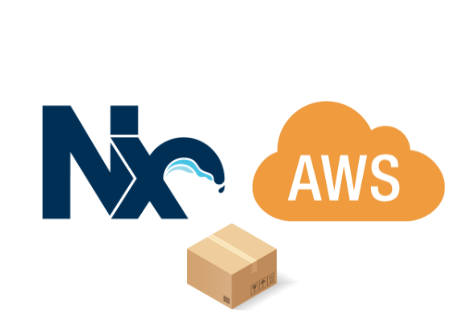

<h1 align="center">AWS Deploy Plugins</h1>

<i>A suite of NX plugins designed to streamline the deployment of your projects onto AWS effortlessly</i>

These plugins were meticulously crafted to address the need for a <b>lightweight</b> solution, avoiding the complexities of full-fledged frameworks like <a href="https://github.com/serverless/serverless">Serverless</a> or <a href="https://github.com/aws/serverless-application-model">SAM</a>, while also eliminating the necessity of developing custom deployment scripts.

## 🚀 Plugins

| Name                                                   | Description                                | Status             |
| ------------------------------------------------------ | ------------------------------------------ | ------------------ |
| [@aws-deploy-plugins/lambda](plugins/lambda/README.md) | AWS Lambda deploy plugin for NX workspace. | <b>Implemented</b> |
| @aws-deploy-plugins/ecs                                | AWS ECS deploy plugin for NX workspace.    | <i>Planned</i>     |

## License

[MIT](https://choosealicense.com/licenses/mit/)
